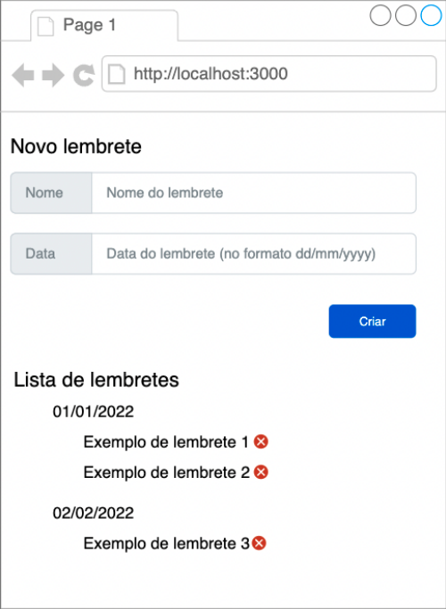

# ReminderApp
**🚀 Repositório da prova prática para processo seletivo da Dti Digital**

- [Funcionalidades](#funcionalidades)
- [Requisitos](#requisitos)
- [Configuração](#configuracao)
- [Rotas](#rotas)
- [Contato](#contato)
- [Descrição do desafio](#Descrição)

## <a id="funcionalidades"></a> ✨ Funcionalidades

O Sistema possui as seguintes funcionalidades principais:

- Criar um lembrete, informando a descrição e a data do mesmo

- Vizualizar a lista de todos os lembretes criados, separados por data em ordem cronológica

- Permitir a exclusão de lembretes

## <a id="requisitos"></a>🔨 Requisitos

- Possuir ``NodeJs``, ``NPM`` , ``Git Bash`` e ``Visual Studio Code`` instalados no computador

- (Opcional) Possuir ``Postman/Insomnia`` instalados para consultar as rotas separadamente.
## <a id="configuracao"></a>⚙️ Configuração

Siga as etapas abaixo para configurar o projeto em seu ambiente local:

1. **Clone o repositório do GitHub:**
```nodejs
git clone git@github.com:PepeuBH/dti-digital-teste.git
```

2. **Acesse a pasta backend**
```nodejs
cd backend/
```

3. **Instale as dependências do projeto:**
```nodejs
npm install
```

4. **Execute o backend:**
```nodejs
npm start
```


5. **Acesse a pasta frontend**<br>
- Caso queira sair da pasta do backend: <br>
```nodejs
cd ..
```
```nodejs
cd frontend/
```

6. **Instale as dependências do projeto:**
```nodejs
npm install
```

7. **Execute o frontend:**
```nodejs
npm start
```


## <a id="rotas"></a>🛣️ Rotas


A API possui as seguintes rotas disponíveis:

- **`GET`** **`http://localhost:3333/lembretes`**: Rota responsável por listar todos os lembretes criados
##### RESPONSE
```JSON
[
	{
		"id": "61785397",
		"descricao": "Passar na prova prática da DTI",
		"data": "2023-09-22"
	},
    	{
		"id": "0083de76",
		"descricao": "Churrasco no clube",
		"data": "2023-09-23"
	},
	{
		"id": "08af2542",
		"descricao": "Ir ao shopping",
		"data": "2023-09-24"
	},
]
```
- **`POST`** **`http://localhost:3333/lembretes`**: Rota responsável por criar um novo lembrete a partir de um objeto JSON e retornar o id deste lembrete<br>
##### RESQUEST
```JSON
{
	"descricao" : "Decolar o Foguete!",
	"data" : "2023-09-23"
}
```
##### RESPONSE
```JSON
{
	"id": "f75f024f"
}
```
- **`DELETE`** **`http://localhost:3333/lembretes/id_Lembrete`**: Rota responsável por deletar um lembrete, recebendo como parâmetro o id do mesmo


    - Utilize o Postman/Insomnia para testar as rotas sem o frontend

## <a id="contato"></a>📧 Contato

Se você tiver alguma dúvida ou sugestão em relação a este projeto, entre em contato comigo pelo [Linkedin](https://www.linkedin.com/in/pedro-talma-toledo/)

## <a id="Descrição"></a> Descrição do desafio

### Instruções gerais

• Fazer a prova em .net, node e React. A aplicação deve ser web

• O código deve ser executável

• Você pode utilizar de quaisquer bibliotecas de componentes que desejar

### Instruções para entrega do teste
1. Você deverá entregar seu teste através de git (Github);

2. O envio do teste não pode ser feito através de um link do Github público, podendo gerar
desclassificação;

3. O teste precisa estar na modalidade privada;

4. ACESSO GITHUB: o acesso ao teste deverá ser liberado para o e-mail dtirackers@gmail.com, até
a data máxima de entrega do resultado do seu teste;

5. Você tem até dia 5 dias para enviar sua resposta;

6. FORMALIZAÇÃO DA RESPOSTA AO TESTE POR E-MAIL: o resultado do seu teste, com o link do teste
no Github, deve ser enviado para o e-mail isadora.louise@dtidigital.com.br como forma de
formalizar sua resposta do nosso teste prático ai RH.

### Bônus
• Testes unitários

• Não utilizar biblioteca de componentes

• Utilização de CSS/SCSS modules ou Styled Components

### O que deve ser enviado
• Código construído

• Premissas assumidas

• Decisões de projeto

• Instruções pra executar o sistema

### O que deve ser construído
Você deverá desenvolver um sistema de criação de lembretes, seguindo a ideia abaixo:


Lembrando que a imagem é ilustrativa.

### Ao utilizar o sistema:
- Deverá ser possível adicionar um novo lembrete, informando o nome e a data do lembrete

    - Ao clicar em “Criar”, os campos deverão ser validados seguindo as regras:

        - O campo “Nome” deverá estar preenchido

        - O campo “Data” deverá estar preenchido, com uma data válida, e essa data
          tem de estar no futuro

    - Caso os valores dos campos sejam válidos, o novo lembrete deverá ser exibido na
      seção “Lista de lembretes”

- Deverá ser possível deletar um lembrete anteriormente adicionado, clicando no “x”

- Ao adicionar um novo lembrete, caso a sua data já exista, ele deverá aparecer dentro da lista
referente àquele dia; caso não, um novo dia deverá ser exibido, contendo aquele novo dia

- Os dias da lista de lembretes deverão ser exibidos em ordem cronológica

### Critérios de avaliação
- Qualidade do código

    - Separação de responsabilidades, leitura, nomeação de variáveis e métodos, orientação a objetivos
      Clareza e legibilidade

- Utilização de HTML semântico

- [Bônus] Utilização de pré/pós processadores de CSS

- [Bônus] Criação da API seguindo os padrões RESTful

    - Bons nomes de rotas, utilização correta de métodos e status HTTP

- [Bônus] Testes automatizados unitários, tanto no front-end quanto no back-end

### Informações importantes
- É necessário que você confira com sua universidade se você está apto(a) para fazer estágio de 6h antes de aceitar participar do processo.

### Resultado do teste prático
- Após a entrega do resultado do seu teste prático pedimos 7 dias para correção e envio ou do feedback personalizado ou comunicação sobre os próximos passos do processo seletivo.

## Boa sorte!
